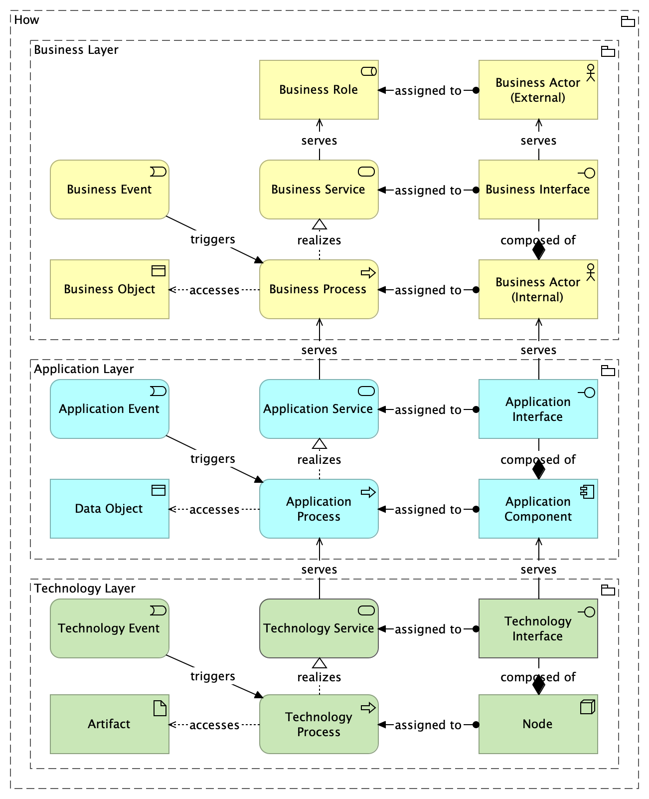
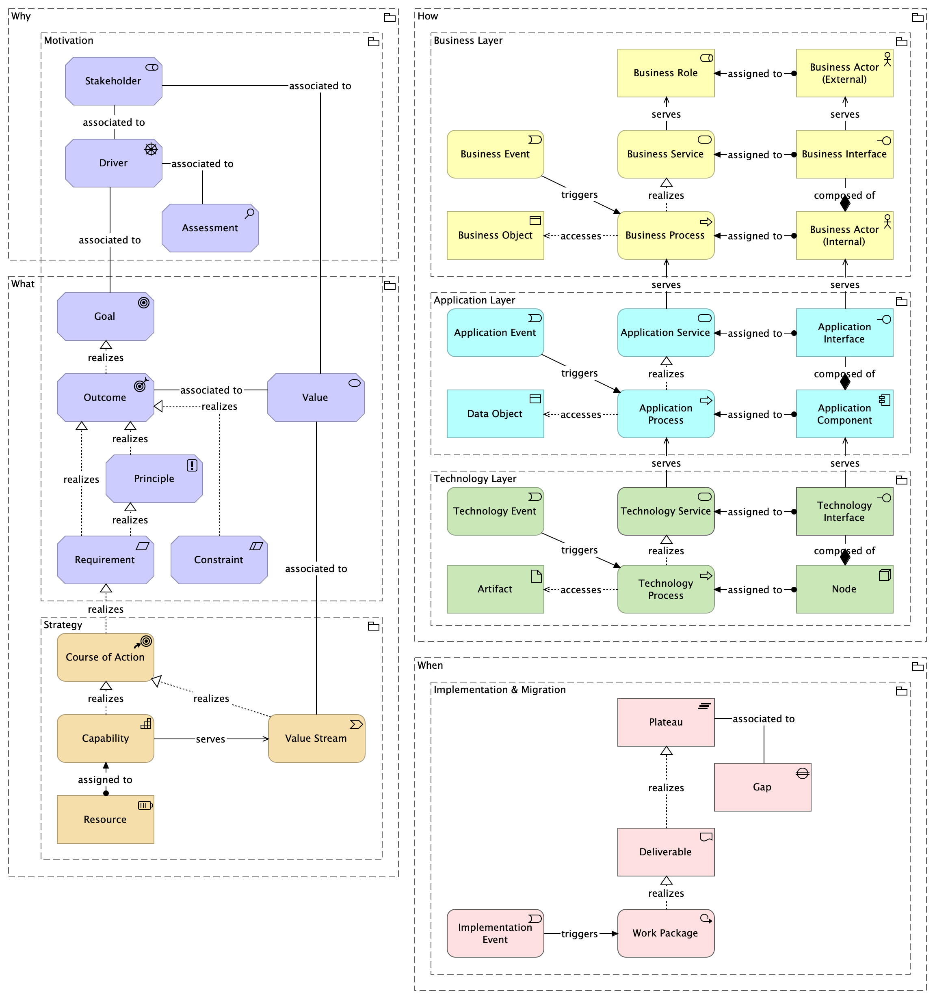

# Excalidraw Archimate Libraries

The [ArchiMate Enterprise Architecture modeling language](https://pubs.opengroup.org/architecture/archimate3-doc/index.html)
provides a uniform representation for diagrams that describe Enterprise Architectures.

## ArchiMate Core Metamodel

The ArchiMate language defines a core metamodel that is used to model the structure and behavior of an enterprise. The
core metamodel answer the question how change is realized in an enterprise.

## ArchiMate Full Metamodel

The ArchiMate language defines a full metamodel that extends the core metamodel with additional elements. The full
metamodel answer the questions why, what, how, and when change is realized in an enterprise.

## Motivation Elements

[Motivation elements](https://pubs.opengroup.org/architecture/archimate3-doc/ch-Motivation-Elements.html) are used to
model the motivations, or reasons, that guide the design or change of an Enterprise Architecture.

The following table gives an overview of the motivation elements, with their definitions.

| Element     | Definition                                                                                                                                           |
|-------------|------------------------------------------------------------------------------------------------------------------------------------------------------|
| Stakeholder | Represents the role of an individual, team, or organization (or classes thereof) that represents their interests in the effects of the architecture. |
| Driver      | Represents an external or internal condition that motivates an organization to define its goals and implement the changes necessary to achieve them. |
| Assessment  | Represents the result of an analysis of the state of affairs of the enterprise with respect to some driver.                                          |
| Goal        | Represents a high-level statement of intent, direction, or desired end state for an organization and its stakeholders.                               |
| Outcome     | Represents an end result, effect, or consequence of a certain state of affairs.                                                                      |
| Principle   | Represents a statement of intent defining a general property that applies to any system in a certain context in the architecture.                    |
| Requirement | Represents a statement of need defining a property that applies to a specific system as described by the architecture.                               |
| Constraint  | Represents a limitation on aspects of the architecture, its implementation process, or its realization.                                              |
| Meaning     | Represents the knowledge or expertise present in, or the interpretation given to, a concept in a particular context.                                 |
| Value       | Represents the relative worth, utility, or importance of a concept.                                                                                  |

## Strategy Elements

[Strategy elements](https://pubs.opengroup.org/architecture/archimate3-doc/ch-Strategy-Layer.html) are used to model the
strategic direction and choices of an enterprise, as far as the impact on its architecture is concerned.

The following table gives an overview of the strategy elements, with their definitions.

| Element          | Definition                                                                                                                      |
|------------------|---------------------------------------------------------------------------------------------------------------------------------|
| Resource         | Represents an asset owned or controlled by an individual or organization.                                                       |
| Capability       | Represents an ability that an active structure element, such as an organization, person, or system, possesses.                  |
| Value Stream     | Represents a sequence of activities that create an overall result for a customer, stakeholder, or end user.                     |
| Course of Action | Represents an approach or plan for configuring some capabilities and resources of the enterprise, undertaken to achieve a goal. |

## Business Elements

[Business elements](https://pubs.opengroup.org/architecture/archimate3-doc/ch-Business-Layer.html) are used to model the
operational organization of an enterprise in a technology-independent manner.

The following table gives an overview of the business elements, with their definitions.

| Element                | Definition                                                                                                                                                                                                                                    |
|------------------------|-----------------------------------------------------------------------------------------------------------------------------------------------------------------------------------------------------------------------------------------------|
| Business Actor         | Represents a business entity that is capable of performing behavior.                                                                                                                                                                          |
| Business Role          | Represents the responsibility for performing specific behavior, to which an actor can be assigned, or the part an actor plays in a particular action or event.                                                                                |
| Business Collaboration | Represents an aggregate of two or more business internal active structure elements that work together to perform collective behavior.                                                                                                         |
| Business Interface     | Represents a point of access where business services are made available to the environment.                                                                                                                                                   |
| Business Process       | Represents a sequence of business behaviors that achieves a specific result such as a defined set of products or business services.                                                                                                           |
| Business Function      | Represents a collection of business behavior based on a chosen set of criteria such as required business resources and/or competencies, and is managed or performed as a whole.                                                               |
| Business Interaction   | Represents a unit of collective business behavior performed by (a collaboration of) two or more business actors, business roles, or business collaborations.                                                                                  |
| Business Event         | Represents a business-related state change.                                                                                                                                                                                                   |
| Business Service       | Represents explicitly defined behavior that a business role, business actor, or business collaboration exposes to its environment.                                                                                                            |
| Business Object        | Represents a concept used within a particular business domain.                                                                                                                                                                                |
| Contract               | Represents a formal or informal specification of an agreement between a provider and a consumer that specifies the rights and obligations associated with a product and establishes functional and non-functional parameters for interaction. |
| Representation         | Represents a perceptible form of the information carried by a business object.                                                                                                                                                                |
| Product                | Represents a coherent collection of services and/or passive structure elements, accompanied by a contract, which is offered as a whole to (internal or external) customers.                                                                   |

## Application Elements

[Application elements](https://pubs.opengroup.org/architecture/archimate3-doc/ch-Application-Layer.html) are used to
model the structure, behavior, and interaction of the applications of the enterprise.

The following table gives an overview of the application elements, with their definitions.

| Element                   | Definition                                                                                                                                           |
|---------------------------|------------------------------------------------------------------------------------------------------------------------------------------------------|
| Application Component     | Represents an encapsulation of application functionality aligned to implementation structure, which is modular and replaceable.                      |
| Application Collaboration | Represents an aggregate of two or more application internal active structure elements that work together to perform collective application behavior. |
| Application Interface     | Represents a point of access where application services are made available to a user, another application component, or a node.                      |
| Application Process       | Represents a sequence of application behaviors that achieves a specific result.                                                                      |
| Application Function      | Represents automated behavior that can be performed by an application component.                                                                     |
| Application Interaction   | Represents a unit of collective application behavior performed by (a collaboration of) two or more application components.                           |
| Application Event         | Represents an application state change.                                                                                                              |
| Application Service       | Represents an explicitly defined exposed application behavior.                                                                                       |
| Data Object               | Represents data structured for automated processing.                                                                                                 |

## Technology Elements

[Technology elements](https://pubs.opengroup.org/architecture/archimate3-doc/ch-Technology-Layer.html) are used to model
the structure and behavior of the technology infrastructure of the enterprise.

The following table gives an overview of the technology elements, with their definitions.

| Element                  | Definition                                                                                                                                                |
|--------------------------|-----------------------------------------------------------------------------------------------------------------------------------------------------------|
| Node                     | Represents a computational or physical resource that hosts, manipulates, or interacts with other computational or physical resources.                     |
| Device                   | Represents a physical IT resource upon which system software and artifacts may be stored or deployed for execution.                                       |
| System Software          | Represents software that provides or contributes to an environment for storing, executing, and using software or data deployed within it.                 |
| Technology Collaboration | Represents an aggregate of two or more technology internal active structure elements that work together to perform collective technology behavior.        |
| Technology Interface     | Represents a point of access where technology services offered by a technology internal active structure can be accessed.                                 |
| Path                     | Represents a link between two or more technology internal active structure elements, through which these elements can exchange data, energy, or material. |
| Communication Network    | Represents a set of structures that connects devices or system software for transmission, routing, and reception of data.                                 |
| Technology Function      | Represents a collection of technology behavior that can be performed by a technology internal active structure element.                                   |
| Technology Process       | Represents a sequence of technology behaviors that achieves a specific result.                                                                            |
| Technology Interaction   | Represents a unit of collective technology behavior performed by (a collaboration of) two or more technology internal active structure elements.          |
| Technology Event         | Represents a technology state change.                                                                                                                     |
| Technology Service       | Represents an explicitly defined exposed technology behavior.                                                                                             |
| Artifact                 | Represents a piece of data that is used or produced in a software development process, or by deployment and operation of an IT system.                    |
| Equipment                | Represents one or more physical machines, tools, or instruments that can create, use, store, move, or transform materials.                                |
| Facility                 | Represents a physical structure or environment.                                                                                                           |
| Distribution Network     | Represents a physical network used to transport materials or energy.                                                                                      |
| Material                 | Represents tangible physical matter or energy.                                                                                                            |

## Implemenation & Migration Elements

[Implementation and migration elements](https://pubs.opengroup.org/architecture/archimate3-doc/ch-Implementation-and-Migration-Layer.html)
are used to model implementation programs and projects to support program, portfolio, and project management.

The following table gives an overview of the implementation and migration elements, with their definitions.

| Element              | Definition                                                                                                                         |
|----------------------|------------------------------------------------------------------------------------------------------------------------------------|
| Work Package         | Represents a series of actions identified and designed to achieve specific results within specified time and resource constraints. |
| Deliverable          | Represents a precisely defined result of a work package.                                                                           |
| Implementation Event | Represents a state change related to implementation or migration.                                                                  |
| Plateau              | Represents a relatively stable state of the architecture that exists during a limited period of time.                              |
| Gap                  | Represents a statement of difference between two plateaus.                                                                         |
